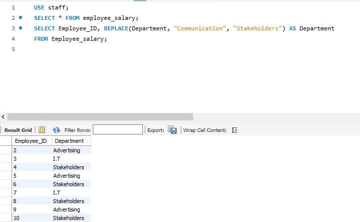
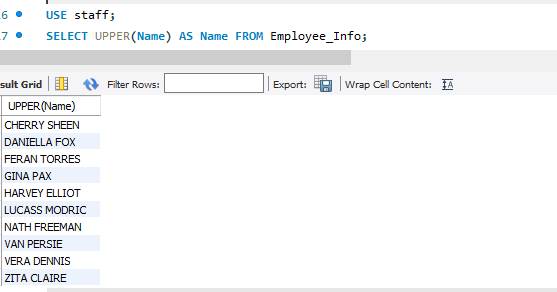
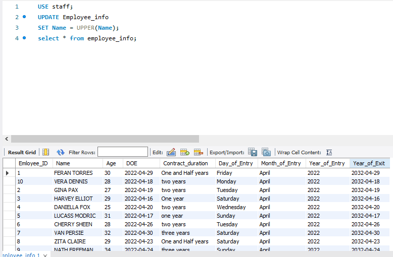
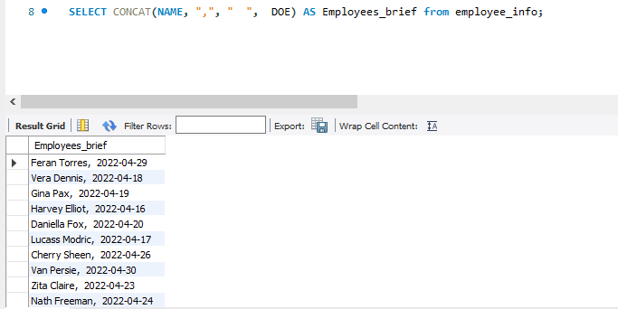

### UPDATING A TABLE IN MYSQL
## **Introduction**
Updating tables in MySQL uses the Command "UPDATE" which is used to modify data within a table.Using "SET" changes specific column's values."WHERE" focuses changes on chosen rows,maintaining data accuracy
## **Problem Statement**
with the student's data
- To replace the department 'Communication' with 'Stakeholders' and show the result of the replacement done
- Update the "Name" column ensuring that the values are all in UPPER CASE
- Run a query that will show the Employees' Names and DOE in onecolumn as "Employyee's brief"
- To write a query that will remove leading spaces from the Name columns (if exist)
## Result/Discussiont
- To replace the department 'Communication' with 'Stakeholders',Below is a snipshot with the syntax used to carry out the command and also a table showing the command being effected
- 
- ---
- To update the "Name" column ensuring that all values are in UPPER CASE,Below is a snipshot with the syntax used to carry out the command and also a table showing the command being effected

---
- To run a query that will show the Employees' Names and DOE in one column as "Employyee's brief",the snipshot below shows the syntax used to carry out the command and also a table showing the command being effected

---
## **Conclusion**
- Using the above syntaxs/commands,it was possible to provide solutions to the above problems
